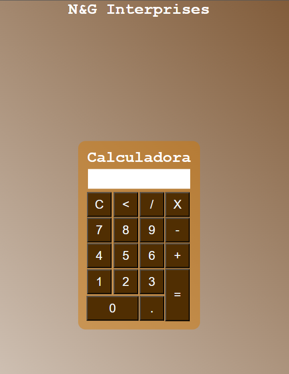

# 🧮 Calculadora Básica

Uma **calculadora simples e funcional** criada utilizando **HTML**, **CSS** e **JavaScript**.  
Este projeto tem como objetivo reforçar conceitos de **manipulação de DOM**, **eventos** e **lógica de programação**.

---

## 🚀 Funcionalidades

- Realiza operações matemáticas básicas:
  - ✅ Adição
  - ✅ Subtração
  - ✅ Multiplicação
  - ✅ Divisão
- Botão "C" para limpar a tela
- Atualização do visor em tempo real
- Interface amigável e responsiva
- Estilização moderna com animações suaves

---

## 🎨 Paleta de Cores Utilizada

| Elemento             | Cor             | Código Hexadecimal                       |
|----------------------|-----------------|------------------------------------------|
| Fundo Principal      | Marrom e Branco |`rgb(255, 255, 255), rgb(92, 44, 0)`  |
| Fundo da Calculadora | Branco          | `rgba(211, 120, 0, 0.459)`             |
| Tela de Visor        | Cinza Claro     | `rgb(255, 255, 255)`                   |
| Botões de Números    | Cinza Médio     | `rgb(80, 46, 2)`                       |
| Botões de Operadores | Azul Escuro     | `rgb(80, 46, 2)`                       |
| Botão de Igual (=)   | Verde Limão     | `rgb(80, 46, 2)`                       |
| Texto dos Botões     | Preto           | `rgb(240, 248, 255)`                   |

Essa paleta foi escolhida para transmitir leveza e modernidade ao design.

---

## 🛠️ Tecnologias Utilizadas

- HTML5 – Estrutura da página
- CSS3 – Estilos e responsividade
- JavaScript (ES6+) – Funções para cálculos e eventos

---

## 📁 Estrutura de Arquivos

```
calculadora/ 
├── index.html # Estrutura HTML da calculadora 
├── style.css # Estilização visual (cores, layout) 
└── script.js # Lógica de funcionamento da calculadora
```
---

## 📸 Imagem do Projeto



---

## 📸 Prévia do projeto

(https://neginterprises.github.io/Calculadora-Basica/)